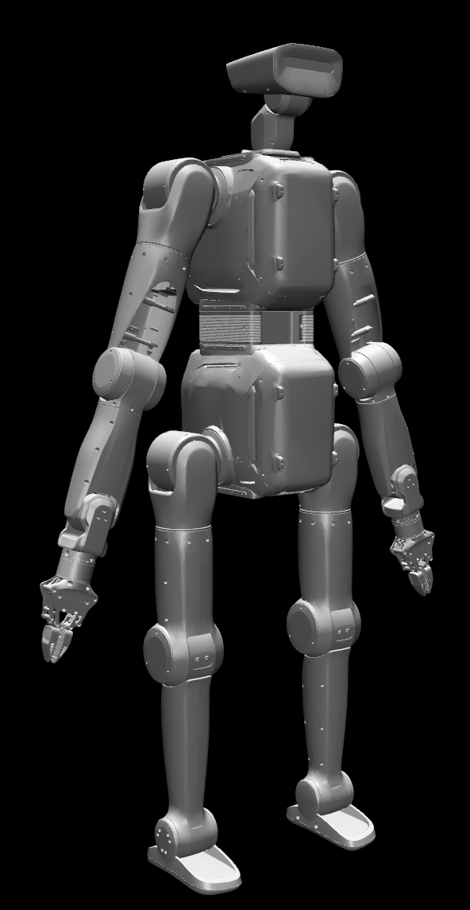
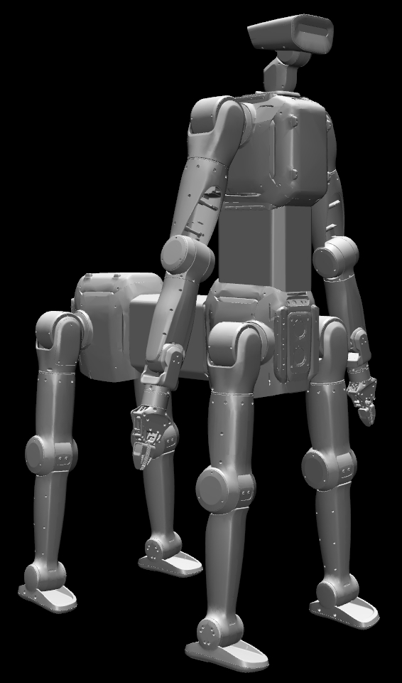

<!--
  SPDX-FileCopyrightText: 2024-2026 LimX Dynamics Technology Co., Ltd.
  SPDX-License-Identifier: Apache-2.0
-->

[English](README.md) | [中文](README_zh-CN.md)

> **发布渠道：** 本仓库的开源主副本托管于
> [`github.com/limx-tron2/robot-description`](https://github.com/limx-tron2/robot-description)。
> 内网 GitLab 地址
> `192.168.2.65:8022/rl/poc/tron/tron2_open_source/robot-description`
> 仅作为 LimX 内部开发使用的私有镜像。

# TRON2 机器人描述（TRON2 robot description）

面向 **TRON2A** 机器人各型号的 URDF / xacro、MuJoCo XML、网格（mesh）以及可选的 USD 资产。本仓库用于仿真、可视化以及下游工具链（ROS 1/2、MuJoCo、Isaac Sim 等）。

## 许可与署名（License & attribution）

本项目基于 **Apache License, Version 2.0**（2004 年 1 月）发布。完整许可文本请参见 [`LICENSE`](LICENSE) 文件。SPDX 标识符：`Apache-2.0`。

- [`NOTICE`](NOTICE) — 必要的署名声明。
- [`THIRD_PARTY_NOTICES.md`](THIRD_PARTY_NOTICES.md) — 各资产的出处，以及 YG 型号所引用的外部硬件说明。
- [`SECURITY.md`](SECURITY.md) — 如何上报安全漏洞。
- [`CONTRIBUTING.md`](CONTRIBUTING.md) — 再生成流程、网格策略、DCO 签署说明。
- [`ASSETS.md`](ASSETS.md) — 资产清单与生成流水线。
- [`CHANGELOG.md`](CHANGELOG.md) — 发布说明。

## 适用范围（Scope）

**本仓库包含**：

- 六个 TRON2A 型号（`DA`、`DACH`、`WF`、`SF`、`WFYG`、`SFYG`）的 URDF 与 xacro 源文件。
- 各型号带 IMU site 的 MuJoCo XML 模型。
- 二进制 STL 网格（视觉 + 碰撞）。
- 用于 Isaac Sim / Omniverse 工作流的 USD 资产。
- 位于 `docs/images/` 的参考图片。

**本仓库不包含**（有意为之）：

- 不含控制策略文件（`.onnx`、`.pt`、`.pth`、`.ckpt`）。
- 不含 SDK 二进制（`.so`、`.dll`、`.dylib`、`.lib`）或 Python wheel。
- 不含逐机身或全局的出厂标定（factory-calibration）数值。
- 不含固件或引导程序（bootloader）产物。
- 不含运动 / 轨迹数据（rosbag、MCAP、HDF5 记录）。
- 不含客户或站点特定的配置。

关于部署栈、模型权重与 SDK，请参见 `limx-tron2` 组织下的同级仓库。

## 仓库结构（Repository layout）

每种硬件 / 软件配置位于 `tron2a/<VARIANT>/` 目录下：

| 路径 | 内容 |
|------|-----------|
| `urdf/` | 生成的或手工维护的 URDF |
| `xacro/` | xacro 源文件（宏 include、碰撞选项） |
| `xml/` | MuJoCo 模型（`robot.xml`） |
| `meshes/` | 模型引用的 STL 网格 |
| `usd/` | USD 资产（部分型号提供） |

各型号的插图位于 [`docs/images/`](docs/images/)，并嵌入下文的 [模型](#模型models) 章节。

---

## 关节零位约定（Joint zero convention）

- **旋转 / 平动关节：** 在这些模型中，**零角度或零位移** 指导出的 URDF/MuJoCo 关节轴定义与静止中性网格姿态一致时的关节值。请以此作为控制器与仿真器的软件零位。
- **浮动基座（Floating base）：** 基座在世界坐标系中为 **浮动**（六自由度：位置 + 姿态）。MuJoCo 通常在根节点使用 **free joint**；URDF 在适用处使用 **floating** 基座关节。变换请以 **`base_Link`** / 文档中约定的根链接为基准；世界位姿来自仿真或你的定位栈。
- **标定（Calibration）：** 出厂前每台机器人都会经过 **出厂标定（factory-calibrated）**，使关节零位与 **本仓库 URDF 中定义的标准零位** 对齐。正常运行默认此对齐已建立；仅在硬件维修或重大装配变更之后才需要参照维护流程。**本仓库不发布任何标定数值** —— URDF 仅编码名义几何零位。

除非集成栈另有说明，坐标约定遵循典型的 ROS 用法：以根链接为基准，**x** 向前、**y** 向左、**z** 向上。

- **SF / SFYG 腿部形态 —— TRON2A 与 TRON2B 的区别：**
  - **`tron2a/`（TRON2A）：** URDF/MuJoCo 的 **零位** 与实物机器人出厂标定的零位一致 —— **并非** 行走控制所用的膝盖前倾姿态。要获得膝盖前倾姿态，需要在控制器或状态初始化中将每条腿的 **髋关节偏航（hip yaw）** 旋转 **180°**（π rad），例如 `proximal_yaw_L_Joint` / `proximal_yaw_R_Joint`。两种姿态对比见 [SF_TRON2A](#sf_tron2a)。
  - **`tron2b/`（TRON2B）：** URDF 零位 **直接定义为膝盖前倾姿态**，**与实物机器人出厂零位不一致**。这是有意为之的设计选择，目的是让模型在训练与直观理解上更方便（无需再脑内换算 180° 偏航即可直接看出行走站姿），代价是 URDF 零位不再等同于出厂硬件零位。**部署到 TRON2B 实机时，必须应用相应的关节偏置**（即 180° 髋偏航旋转的逆变换），以在 URDF/仿真约定与实机出厂零位之间进行转换。

---

## 型号概览（Variant overview）

| 型号目录 | 简要说明 |
|----------------|-------------------|
| `DA_TRON2A` | 双臂机械手加夹爪；躯干安装 IMU 坐标系。 |
| `DACH_TRON2A` | 双臂配置，**加装 2 自由度头部**（yaw / pitch）。 |
| `WF_TRON2A` | **轮式**腿部设计（膝关节 + 轮）；躯干 IMU。 |
| `SF_TRON2A` | **实心足踝**（Sole Ankle）腿部设计（无轮）；躯干 IMU。 |
| `WFYG_TRON2A` | WF 基础上加装 **上肢外设**（手臂、夹爪、塔杆挂载结构）。 |
| `SFYG_TRON2A` | SF 基础上加装与 `WFYG_TRON2A` 相同的 **上肢外设** 组件。 |
| `DASF_TRON2A` | **上下拼接式人形** — `SF` 踝俯仰腿型通过 `transition_upper_Link` 与 `DACH` 双臂 + 2 自由度头部上肢拼接。 |
| `DASF2_TRON2A` | **半人马式** 变体 — 两组 `SF` 式腿型（前 `_F`、后 `_B`）搭配 `DACH` 双臂 + 头部上肢。 |

**YG** 后缀表示更丰富的上肢 / 塔杆外设布局（手臂、手部及配件结构，详见下文）。**DASF** / **DASF2** 变体将此前独立的下肢（`SF`）与上肢（`DACH`）描述拼接为单一人形，每个身体分段各配一路 IMU。

后缀 **YG** 表示更丰富的上肢 / 塔杆外设布局（手臂、机械手及附属链接—详见下文）。

---

## 各型号外部传感器（External sensors by variant）

以下总结本仓库中所建模的 **躯干安装与塔杆安装外设**。**Gazebo** 一栏指 URDF 中已附带插件的情况；**MuJoCo** 模型则在所列 site 上暴露与 IMU 相关的传感器。实物硬件可能包含此处未建模的设备。对于 **YG** 型号，**Mast & auxiliary URDF (YG)** 一列同时列出模型链接名称与机器人实物硬件（所有 LiDAR / RTK / 计算单元 / 手臂侧负载均安装在 **手臂转接支架** 上，对应 URDF 链接 **`transition_Link`**）。

| Variant | Torso IMU | RGB-D / depth (chest, D435-class) | Mast & auxiliary URDF (YG) | Notes |
|--------|-----------|-------------------------------------|------------------------------|--------|
| `DA_TRON2A` | 有 — 链接 `base_imu` | 有 — `d435_Link` + `d435_optical_frame`（仅几何；无 Gazebo depth 插件） | — | MuJoCo：在 site `base_imu` 上提供四元数 / 陀螺 / 加速度计。 |
| `DACH_TRON2A` | 有 — 链接 `base_imu` | 有 — `d435_Link` + `d435_optical_frame`；带 Gazebo depth camera 插件 | — | 本仓库提供完整 URDF/xacro/XML/USD；2 自由度头部（`head_yaw` / `head_pitch`）。MuJoCo IMU 位于 site `base_imu`。 |
| `WF_TRON2A` | 有 — 链接 `base_imu`；Gazebo `base_imu_sensor` | 有 — `d435_Link` + `d435_optical_frame`；带 Gazebo depth camera 插件 | — | |
| `SF_TRON2A` | 有 — 与 WF 相同 | 有 — 与 WF 相同的 D435 Gazebo 配置 | — | |
| `WFYG_TRON2A` | 有 | 有 — 与 WF 相同的胸前 D435 | **URDF（网格 / 运动学）：** `transition_Link`（转接件）、`camera_mount_Link`、`radar_Link`、`antenna_L_Link`、`antenna_R_Link`。**实物硬件**（安装在 `transition_Link` 上）：LiDAR **RoboSense Fairy96**（速腾 Fairy96）；双臂 **AgileX Piper X**（松灵 PiperX）；RTK **Huace M722**（华测 M722）；计算单元 **NVIDIA Jetson Orin NX**。**仿真说明：** URDF 仅提供几何 / 碰撞；本包 **不** 提供 Gazebo 雷达 / RF 传感器插件。 | |
| `SFYG_TRON2A` | 有 | 有 | **与 `WFYG_TRON2A` 相同的 YG 组件** — 相同的 URDF 链接集合、相同的实物硬件（`transition_Link` 上的 Fairy96、Piper X、M722、Orin NX），以及相同的仿真注意事项。 |  |
| `DASF_TRON2A` | 两路 — 下肢 `base_imu`，上肢 `upper_base_imu` | 有 — 上肢 `d435_U_Link` + `d435_optical_frame_U` | — | `SF` 腿型与 `DACH` 双臂 / 头部通过 `transition_upper_Link` 拼接；MuJoCo 在 `base_imu` 与 `upper_base_imu` 两个站点均配置 IMU 传感器。 |
| `DASF2_TRON2A` | 三路 — `limx_F_imu`（前腿）、`limx_B_imu`（后腿）、`limx_H_imu`（头部 / 上肢） | 有 — `d435_F_Link`、`d435_B_Link`、`d435_H_Link`（前 / 后 / 头部相机） | — | 半人马式：两组 `SF` 式腿型（经 `transition_middle_Link` 连接前腿，后腿直连）加上通过 `transition_upper_Link` 拼接的 `DACH` 上肢。 |

**图例：** “RGB-D / depth” 沿用 Intel RealSense **D435** 风格的光学坐标系与 Gazebo `depth` 传感器命名（如存在，为 `d435_camera_sensor`）。如需仿真雷达或额外相机，请自行添加驱动或 Gazebo 插件。

---

## 模型（Models）

### DA_TRON2A


- **简介：** 双足机器人，配 **双臂** 与 **平行夹爪**；适用于面向操作的仿真与控制开发。
- **根节点 / IMU：** URDF 中链接 `base_imu` 固定于 `base_Link`，对齐躯干 IMU 原点。MuJoCo 在浮动根上使用 site `base_imu`，提供四元数、陀螺与加速度计传感器。
- **末端执行器：** 左 / 右臂末端为平行夹爪链接 `grasper_L_Link` / `grasper_R_Link`（在默认 `robot.urdf` 中固定连接）。胸前挂载的 RealSense **D435** 建模为 `d435_Link` + `d435_optical_frame`。
- **典型路径：** `tron2a/DA_TRON2A/urdf/robot.urdf`、`tron2a/DA_TRON2A/xml/robot.xml`。

### DACH_TRON2A


- **简介：** 与 **DA** 相同的双臂组件，另外配备 **2 自由度头部**（`head_yaw_Joint`、`head_pitch_Joint`）用于感知。
- **根节点 / IMU：** IMU 建模方式与 DA 相同（URDF 链接 `base_imu`；MuJoCo site `base_imu`，含姿态 / 陀螺 / 加速度传感器）。
- **典型路径：** `tron2a/DACH_TRON2A/urdf/robot.urdf`、`tron2a/DACH_TRON2A/xml/robot.xml`（USD 位于 `tron2a/DACH_TRON2A/usd/`；网格位于 `tron2a/DACH_TRON2A/meshes/`）。

### WF_TRON2A


- **简介：** 面向移动能力的型号，踝部配 **驱动轮**（`wheel_L_Link` / `wheel_R_Link`），并带膝关节（`knee_*`）。
- **根节点 / IMU：** URDF 链接 `base_imu` 固定于 `base_Link`；MuJoCo 在该 site 上暴露 `base_imu` 传感器（姿态、陀螺、加速度计）。
- **典型路径：** `tron2a/WF_TRON2A/urdf/robot.urdf`、`tron2a/WF_TRON2A/xml/robot.xml`。

### SF_TRON2A

- **简介：** 采用 **踝关节俯仰（ankle pitch）** 而非车轮的腿部设计；髋 / 膝层级的腿部拓扑与 WF 类似。
- **根节点 / IMU：** 与 **WF_TRON2A** 相同的 `base_imu` / MuJoCo 传感器布局。
- **零位与控制姿态（膝盖前倾，knees-forward）：** 网格 / URDF 的 **零位** 与左图站立姿态一致。全身控制通常希望采用 **膝盖前倾**——膝盖指向前方（类人站姿）。在软件中，可通过将每条腿的 **髋关节偏航（hip yaw）** 旋转 **180°**（π rad）得到该姿态，例如 `proximal_yaw_L_Joint` 与 `proximal_yaw_R_Joint`，效果如右图所示。模型文件本身仍编码名义零位；请在你的控制器或状态初始化中按需应用该偏置。

| 零位姿态（名义运动学零位） | 用于控制的膝盖前倾姿态（每腿 yaw 约 180° 后） |
| --- | --- |
|  |  |

- **典型路径：** `tron2a/SF_TRON2A/urdf/robot.urdf`、`tron2a/SF_TRON2A/xml/robot.xml`。

### WFYG_TRON2A


- **简介：** 在 **WF** 移动底座之上，加装 **双臂**、夹爪，以及 **塔杆挂载的附属几何**：`camera_mount_Link`、嵌套的 `radar_Link`，以及成对的 `antenna_*` 链接（提供视觉 / 碰撞网格，便于与感知栈集成）。
- **根节点 / IMU：** 与 WF 相同的躯干 IMU 布局（URDF 中的 `base_imu`；MuJoCo 在 `base_imu` 上的 IMU 传感器）。
- **硬件 / 塔杆：** 实物 LiDAR、机械臂、RTK、计算单元与安装坐标系详见 [各型号外部传感器](#各型号外部传感器external-sensors-by-variant)；URDF 仅使用网格 / 链接，除非你在本地增补 Gazebo 插件。
- **操作坐标系：** MuJoCo 模型（`xml/robot.xml`）中提供一个固定的 `gripper_pick` 刚体，用作抓取规划的夹爪拾取点。
- **典型路径：** `tron2a/WFYG_TRON2A/urdf/robot.urdf`、`tron2a/WFYG_TRON2A/xml/robot.xml`。

### SFYG_TRON2A


- **简介：** 采用 **SF** 踝俯仰腿型，配 **YG** 上肢与塔杆外设，布局与 `WFYG_TRON2A` 相同。
- **腿部与 SF 对比：** 与 **SF_TRON2A** 腿部语义相同 —— URDF 零位是实机出厂零位，**并非** 膝盖前倾控制姿态（TRON2A/TRON2B 的区别及膝盖前倾所需的 180° 髋偏航偏置，详见 [关节零位约定](#关节零位约定joint-zero-convention)）。
- **根节点 / IMU：** 与其他 SF/WF YG 型号相同（`base_imu` / MuJoCo IMU 块）。
- **硬件 / 塔杆：** 与 WFYG 相同 —— 详见 [各型号外部传感器](#各型号外部传感器external-sensors-by-variant)。
- **操作坐标系：** MuJoCo 模型（`xml/robot.xml`）中与 WFYG 一致的 `gripper_pick` 拾取点刚体。
- **典型路径：** `tron2a/SFYG_TRON2A/urdf/robot.urdf`、`tron2a/SFYG_TRON2A/xml/robot.xml`。

### DASF_TRON2A



- **简介：** **上下拼接式人形** —— `SF` 踝俯仰腿型（下肢）通过 `transition_upper_Link` 与 `DACH` 式双臂 + 2 自由度头部（上肢）拼接。相当于将双足腿部与双臂组件上下拼接成完整人形。
- **腿部与 SF 对比：** 与 **SF_TRON2A** 腿部语义相同 —— URDF 零位是实机出厂零位，**并非** 膝盖前倾控制姿态（TRON2A/TRON2B 的区别及膝盖前倾所需的 180° 髋偏航偏置，详见 [关节零位约定](#关节零位约定joint-zero-convention)）。
- **根节点 / IMU：** 两路 IMU —— 下肢 `base_imu`，上肢 `upper_base_imu`；均以 MuJoCo IMU 传感器站点形式提供。
- **硬件 / 相机：** 上肢深度相机（`d435_U_Link` / `d435_optical_frame_U`）；手臂 / 头部硬件延续 `DACH_TRON2A` 上肢布局 —— 详见 [各型号外部传感器](#各型号外部传感器external-sensors-by-variant)。
- **典型路径：** `tron2a/DASF_TRON2A/urdf/robot_rl.urdf`、`tron2a/DASF_TRON2A/xml/robot.xml`。

### DASF2_TRON2A



- **简介：** **半人马式** 变体 —— 两组 `SF` 式腿型前后拼接（`front_base_Link` 与 `back_base_Link` 经 `transition_middle_Link` 连接），并在前腿上方通过 `transition_upper_Link` 拼接一套 `DACH` 式双臂 + 头部上肢。
- **腿部与 SF 对比：** 前后两组腿的语义均与 **SF_TRON2A** 相同 —— URDF 零位是实机出厂零位，**并非** 膝盖前倾控制姿态（TRON2A/TRON2B 的区别及膝盖前倾所需的 180° 髋偏航偏置，详见 [关节零位约定](#关节零位约定joint-zero-convention)）。
- **根节点 / IMU：** 三路 IMU —— `limx_F_imu`（前腿）、`limx_B_imu`（后腿）、`limx_H_imu`（头部 / 上肢）；均以 MuJoCo IMU 传感器站点形式提供。
- **硬件 / 相机：** 前 / 后 / 头部深度相机（`d435_F_Link`、`d435_B_Link`、`d435_H_Link`）；手臂 / 头部硬件延续 `DACH_TRON2A` 上肢布局 —— 详见 [各型号外部传感器](#各型号外部传感器external-sensors-by-variant)。
- **典型路径：** `tron2a/DASF2_TRON2A/urdf/robot.urdf`、`tron2a/DASF2_TRON2A/xml/robot.xml`。

---

## ROS 包（ROS packages）

catkin / colcon 的包清单为 [`package.xml`](package.xml)。ROS 包名为 **`robot_description`**。通过提供的 [`CMakeLists.txt`](CMakeLists.txt) 将 `tron2` 资产树安装到工作空间的 share 目录。

**ROS 1（Noetic）：**

```bash
cd ~/catkin_ws/src
ln -s /path/to/robot-description robot_description
cd ..
catkin_make -DCATKIN_WHITELIST_PACKAGES=robot_description
source devel/setup.bash
```

**ROS 2（Humble 或更新版本）：**

```bash
cd ~/ros2_ws/src
ln -s /path/to/robot-description robot_description
cd ..
colcon build --packages-select robot_description
source install/setup.bash
```

资产将安装至 `$(ros2 pkg prefix robot_description)/share/robot_description/tron2a/<VARIANT>/`。

---

## 校验（Verification）

以下命令与 CI 所运行的一致（见 [`.github/workflows/ci.yml`](.github/workflows/ci.yml)）；在提 PR 前先在本地跑一遍可以省去多次评审往返。

```bash
# 1. URDF well-formed
for u in tron2a/*/urdf/*.urdf; do check_urdf "$u"; done

# 2. MuJoCo can load every XML
pip install "mujoco>=2.3"
for x in tron2a/*/xml/*.xml; do
  python -c "import mujoco, sys; mujoco.MjModel.from_xml_path(sys.argv[1])" "$x"
done

# 3. xacro expands cleanly
pip install xacro
for x in tron2a/*/xacro/robot.xacro; do xacro "$x" > /dev/null; done

# 4. Generic XML sanity
xmllint --noout tron2a/*/urdf/*.urdf tron2a/*/xml/*.xml
```

在 Rviz 中预览某个型号：

```bash
ros2 launch urdf_tutorial display.launch.py \
  model:=$(ros2 pkg prefix robot_description)/share/robot_description/tron2a/WF_TRON2A/urdf/robot.urdf
```

---

## 引用与支持（Cite & support）

如果你在学术或公开工作中使用了本描述，请按下述方式引用本仓库：

```
@misc{limx_tron2_robot_description_2026,
  title  = {TRON2 robot description},
  author = {LimX Dynamics},
  year   = {2026},
  howpublished = {\url{https://github.com/limx-tron2/robot-description}}
}
```

- **Bug 反馈 / 功能需求：** [GitHub Issues](https://github.com/limx-tron2/robot-description/issues)。
- **问题咨询 / 集成帮助：** [GitHub Discussions](https://github.com/limx-tron2/robot-description/discussions)。
- **安全上报：** 邮件 `contact@limxdynamics.com`；另见 [`SECURITY.md`](SECURITY.md)。
- **公司 / 商务联系：** <https://www.limxdynamics.com>。

---
